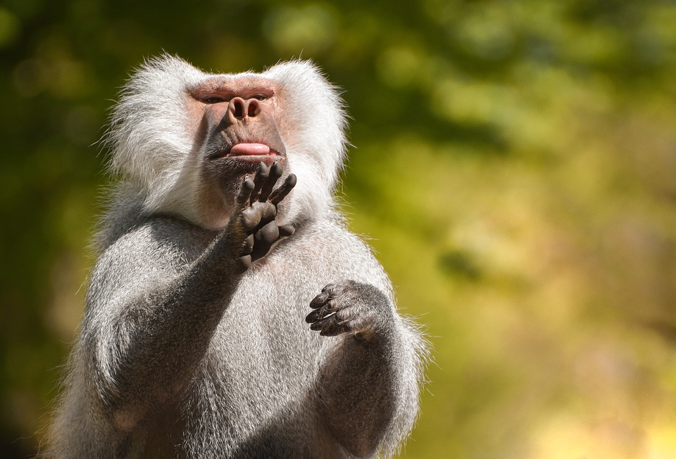

# **HALLO WORLD**

---

## <b>My checkbox list of items for week

- [X]Plantains
- []Schmming
- [x]dancing
- []Coding
- []cleaning
- []playing foot
  ***
  

---

_A table for <strong>our meeting member</strong>_

|ligth color|current state|traditional wear|
|pink color|Hessen|traditional gown|
|green color|Breme state|traditional cap|
|yellow color|Wesbaden state|shoes|

---
* orange
  * avocado
  * mandarin
  1. salat
2. salat dresing
    1. olive  oil

![Visit me at this](/im_ my list for today__

THis keep the text for coding & higthligth
```

This HTML <em>tutorial<em>, you will find more than 200 examples. With our online "Try it Yourself" editor, you can edit and test each example yourself!


---

>


**<i>Markdown Excercis_ my list for today__


<pan> ~~why are you so lazy~~
Amerikanischen Unternehmens Google. Übereinstimmende Statistiken zeigen bei weltweiten Suchanfragen <br> Google &lt;als Marktführer&gt; unter den Internet-Suchmaschinen und als die meistbesuchte Website der Welt. Google bearbeitet jährlich mehr als zwei Billionen Suchanfragen. Wikipedia</span>

---

Section Header
we are having a very nice weather
- pear
- orange

  - avocado
  - mandarin

** My list for today**

1. salat
2. salat dresing
   1. olive oil
   2. tomatoes
3. banana
4. ananas

<detail>
<Summary>Section Header<summary>
we are having a very nice weather
<detail>
